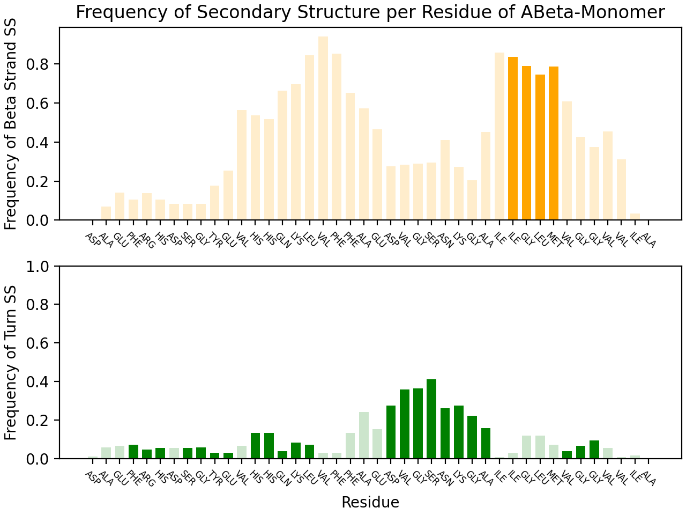

# Amyloid-Beta Secondary Strcuture Analysis
> A program for aligning & comparing the secondary strucutre of AlphaFold-generated Amyloid-Beta complexes with the aggregate strcuture on PDB

## What it Does
This program outputs a scoring chart for the entire output and a scoring plot for each individual monomer.

The **scoring plot** measures the propensity of the secondary structure at that position against the strcuture AlphaFold has created. It begins by generating a frequency table of the secondary structue at each residue position based on ABeta entries in the Protein Data Bank. It then outputs a bar graph where each residue in the monomer is colored in if its generated secondary strcuture matches, otherwise it is transparent.



The **scoring table** takes each target residue (residues that have a secondary strcuture propensity above a certian threshold frequency %) and uses it to compute a score. It also contains AlphaFold's per-residue scoring for the whole monomer and the target resdues.

\# |  Filename                    |  Beta 1 Score  |  Turn Score  |  Beta 2 Score  |  Plddt   |  Plddt Target
----|------------------------------|----------------|--------------|----------------|----------|--------------
1   |  relaxed_model_3_pred_6.pdb  |  0.433         |  0.785       |  0.122         |  61.557  |  64.378
2   |  relaxed_model_5_pred_6.pdb  |  0.340         |  0.223       |  0.0           |  60.359  |  62.939
3   |  relaxed_model_3_pred_0.pdb  |  0.0           |  0.485       |  0.0           |  60.345  |  62.979
4   |  relaxed_model_3_pred_1.pdb  |  0.0           |  0.793       |  0.0           |  59.652  |  62.082
5   |  relaxed_model_3_pred_4.pdb  |  0.023         |  0.785       |  0.0           |  59.644  |  62.092
6   |  relaxed_model_3_pred_3.pdb  |  0.0           |  0.785       |  0.0           |  59.449  |  61.714

## Running the Program
The program can be run by either specifying the output directory of an AlphaFold job or by specifying a directory filled with pdb files.

#### Command-line Options:
```bash
  -i INPUT, --input INPUT
     Input Directory (must be the output of a AlphaFold run or contain PDB files)
  -o OUTPUT, --output OUTPUT
     Output Directory
  --alphafold ALPHAFOLD, -a ALPHAFOLD
     Specifies whether the input directory is the output of an AlphaFold run, which affects if the .pkl metadata is loaded in by the program (default: True)
  --multimer MULTIMER, -m MULTIMER
     Specifies whether the input directory is the output of a multimer run (default: True)
  --relaxed RELAXED, -r RELAXED
     Specifies whether the outputs of alphafold have been relaxed (defualt: True)
  --dataset DATASET, -d DATASET
     Specifies whether to use full of fibril dataset (default: True)
  --output-csv OUTPUT_CSV, -c OUTPUT_CSV
     Specifies the name of the output data table
```

### Examples
To run an analysis on the result of an AlphaFold multimer job:
```bash
./ss_analyze -i inputs/<your input> -o outputs/<your output> -m true -r true
```

## Output
The output directory will contain a ```.csv``` table containing the scoring metrics for all generated results as well as a png image for each scored monomer.

### Scoring table
The table has 5 columns:
- Beta 1 Score: the fraction of residues in the first beta-strand that have a beta-strcuture
- Turn Score: the fraction of residues in the turn that have a turn-strcutur
- Beta 2 Score: the fraction of residues in the second beta-strand that have a beta-strcuture
- Plddt: The [plddt](https://www.ncbi.nlm.nih.gov/pmc/articles/PMC8783046/) score AlphaFold assigns to the entire generated monomer
- Plddt Target: The mean of the [plddt](https://www.ncbi.nlm.nih.gov/pmc/articles/PMC8783046/) score of target residues

### plot
Each monomer is converted to a PNG image.

# Using Your Own Dataset
The program is made for scoring amyloid-beta monomers, but it is possible to score any monomer. In order to generate your dataset, you must create a directory of structure files (``.ent`` or ``.pdb``) containing the desired monomer. If your input file is only a single file containing each frame, you must split this into multiple files by running 
```bash
./bin/frame-splitter.py -i <input>.pdb -o datasets/<output_dir>
```
Next, run
```bash
./bin/generate-structure.py -i <input_dir> -o <output_dir>
```
Next, you need to edit ``ssparser/constants.py`` by setting the values to the sequence that you want to analyze. In order to extract the sequences all unique monomers in your input file, run the following on your processed dataset directory (which should only contain ``.csv`` files)
```bash
./bin/list-chain-residues.py -i <input_dir>
```
Finally, modify ``ssparser/constants.py``:
```python
DATASET_DIR = <Path to your CSV dataset>

ABETA_LONG_SEQUENCE = <your sequence, generated by list_chain_residues.py>
ABETA_LONG_STRING = "".join(ABETA_LONG_SEQUENCE)
ABETA_LONG_RESIDUE_COUNT = len(ABETA_LONG_SEQUENCE)

ABETA_SHORT_SEQUENCE = <your sequence, generated by list_chain_residues.py>
ABETA_SHORT_STRING = "".join(ABETA_SHORT_SEQUENCE)
ABETA_SHORT_RESIDUE_COUNT = len(ABETA_SHORT_SEQUENCE)
```

Lastly, run the following to generate the output plot:
```bash
./ss_parser.py -i <Path to your CSV dataset> -o null --alphafold false --plot-freq true
```

## Example
Let's say that I had a file named ``M1_beus.pdb`` that consisted of multiple pdb frames and I wanted to generate a graph of the frequency of the secondary structure at each position. I would run:
```bash
./bin/frame-splitter.py -i M1_beus.pdb -o datasets/M1_beus_pdb
./bin/generate-structure.py -i datasets/M1_beus_pdb -o datasets/M1_beus
rm -rf datasets/M1_beus_pdb
./bin/list-chain-residues.py -i datasets/M1_beus
```
Then, I would take the output of list-chain-residues and past it into constants.py, as well as change the dataset directory:
```python
DATASET_DIR = os.path.join(file_cwd, "../datasets/M1_beus")

ABETA_LONG_SEQUENCE = ('ASN', 'ASN', 'PRO', 'ALA', 'ILE',...
ABETA_LONG_STRING = "".join(ABETA_LONG_SEQUENCE)
ABETA_LONG_RESIDUE_COUNT = len(ABETA_LONG_SEQUENCE)

ABETA_SHORT_SEQUENCE = ('ASN', 'ASN', 'PRO', 'ALA', 'ILE',...
ABETA_SHORT_STRING = "".join(ABETA_SHORT_SEQUENCE)
ABETA_SHORT_RESIDUE_COUNT = len(ABETA_SHORT_SEQUENCE)
```
```bash
./ss_parser.py -i datasets/M1_beus -o null --alphafold false --plot_freq true --output_csv false
```
